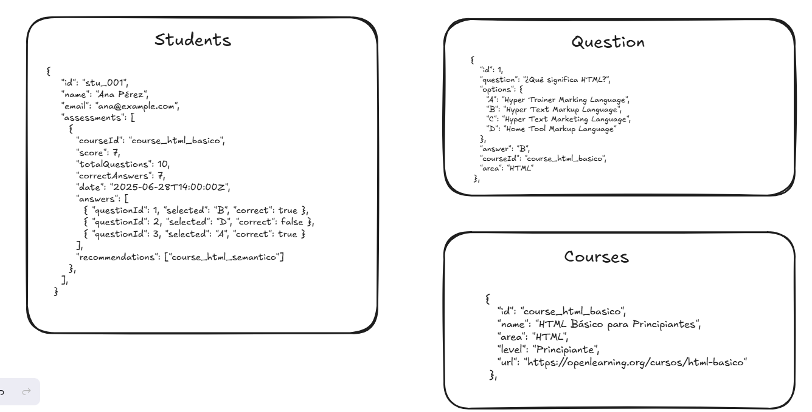

# Prueba Tecnica Emtech

## Breve descripción de las decisiones de diseño y arquitectura tomadas.

Opté por separar el frontend y el backend en dos proyectos independientes para mantener una arquitectura desacoplada y facilitar la escalabilidad. Utilicé React con TypeScript para el frontend y Node.js con Express y TypeScript para el backend. Como base de datos, integré MongoDB Atlas por su facilidad de conexión en la nube y su esquema flexible.

La organización del código se basó en módulos por funcionalidad, lo que permite un mejor mantenimiento y entendimiento del flujo de cada parte de la aplicación. Además, utilicé JWTs para autenticación segura y middlewares personalizados para el manejo de errores y validaciones.

## 10 Preguntas Readme

**1. Describe tu enfoque para la planificación y el desarrollo de esta prueba técnica.**

Para comenzar, me enfoqué en analizar los requerimientos funcionales y entender a detalle los flujos principales del sistema. A partir de esto, diseñé cómo serían las estructuras de datos y su interacción, lo cual me permitió elaborar una primera version diagrama entidad-relación (ER) como base para el diseño de la base de datos y la lógica de negocio del backend.

Con la base de datos clara, planifiqué la arquitectura de la aplicación dividiendo el desarrollo en dos partes: frontend y backend, trabajando cada una de forma independiente pero conectadas mediante una API RESTful. Dado que el objetivo era tener un desarrollo ágil pero funcional, decidí apoyarme en librerías que ya he utilizado previamente, como Ant Design (AntD) para componentes visuales y TailwindCSS para estilos utilitarios rápidos. Esto me permitió avanzar más eficientemente en la construcción de la interfaz, manteniendo una buena experiencia de usuario y un diseño limpio. Finalmente, fui validando cada módulo a medida que avanzaba, priorizando que los flujos esenciales estuvieran bien cubiertos y funcionando de principio a fin.

**2. ¿Qué desafíos encontraste durante el desarrollo y cómo los resolviste?**

Uno de los principales desafíos fue que, conforme avanzaba el desarrollo, la complejidad de la aplicación iba creciendo, especialmente al prestar atención a los detalles que normalmente se dan por sentados en una interfaz de usuario, como validaciones, mensajes de error claros, o flujos alternativos.

Para mantener el enfoque y cumplir con el tiempo estimado, decidí limitar el alcance de la aplicación exclusivamente a los requerimientos principales solicitados, priorizando entregar una versión funcional, limpia y coherente antes de añadir mejoras adicionales.

Otro reto fue establecer rápidamente una estructura sólida para el backend. Para resolverlo, consulté documentación oficial y recursos de referencia, lo que me permitió crear un arquetipo o template base de Express con TypeScript, con configuración de rutas, middlewares y conexión a MongoDB desde el inicio. Esto me ayudó a acelerar el desarrollo sin comprometer buenas prácticas.

**3. Explica las decisiones arquitectónicas clave que tomaste (por ejemplo, estructura de carpetas, elección de tecnologías).**

Tomé decisiones basadas en mi experiencia previa desarrollando aplicaciones fullstack. Separé el frontend y backend para facilitar el mantenimiento. Usé React con TypeScript, TailwindCSS y AntD por su rapidez y flexibilidad en interfaces. Para el backend, opté por Node.js con Express, aplicando una estructura modular por funcionalidades. Utilicé JWT para autenticación y MongoDB Atlas por su fácil integración y escalabilidad.

**4. ¿Cómo probaste tu código? ¿Qué estrategias de prueba utilizaste?**

Debido al tiempo limitado, no implementé pruebas automatizadas. En su lugar, me enfoqué en validar manualmente los happy paths y algunos casos alternativos, aplicando mi experiencia previa para anticipar errores comunes y asegurar que los flujos principales funcionaran de forma estable y coherente.

**5. ¿Qué mejoras o características adicionales agregarías si tuvieras más tiempo?**

En el frontend, me gustaría mejorar secciones como el perfil del usuario y sus configuraciones, agregando más claridad y opciones personalizables. También puliría la parte de notificaciones y la generación de documentos para una mejor experiencia. En el backend, dedicaría más tiempo al sistema de recomendación de cursos, ya que fue diseñado rápidamente y requiere más datos y lógica para construir un algoritmo más preciso y útil.

**6. Describe tu experiencia trabajando con React.js/Next.js (o la tecnología frontend elegida).** He trabajado con React y utilizado bastante de su funcionalidad, por lo que me resulta ágil y cómodo trabajar con tecnologías que ya conozco bien. Esto me permite avanzar rápido y escribir código eficiente y mantenible.

**7. ¿Cuál fue tu experiencia con el backend (Node.js/Express o PHP)?**

Tenía un tiempo sin dedicarme a un desarrollo completo con Express, pero conforme avanzaba y me enfrentaba a problemas como detalles de sintaxis, fui desempolvando y reforzando mis conocimientos. Una vez que tienes la base clara, es cuestión de adaptarla a nuevas metodologías y herramientas, lo que facilita mucho el proceso.

**8. ¿Cómo manejaste la gestión de estados en tu aplicación frontend?**

Utilicé Zustand por su desarrollo rápido y eficiencia, ya que al ser una prueba técnica el tiempo era un factor clave. Consideré que Zustan se adapta mejor a este tipo de proyectos pequeños o medianos, evitando la complejidad y configuración que requiere Redux.

**9. Si utilizaste herramientas de IA como bolt.new o v0 by Vercel, explica por qué y cómo las usaste.**

Utilicé V0 para tener una interfaz clara desde el inicio, ya que ofrece componentes preconstruidos que facilitan y agilizan el desarrollo aunque decidí unicamente tomarlo como referencia para poder usar componentes con los que me siento más cómodo y avanzar más rápido. Además, me apoyé en Copilot para generar cuestionarios y algunos datos mock antes de tener el backend y la base de datos funcionando, lo que me permitió acelerar el desarrollo.

**10. ¿Qué aprendiste o reforzaste al completar esta prueba técnica?**

Me di cuenta de que cuento con el conocimiento necesario para desarrollar proyectos de manera ágil y bajo presión. Aunque no tenga todo el conocimiento fresco, tengo bases sólidas que me permiten adaptarme rápidamente a las adversidades. Además, reforcé la importancia de planificar bien la arquitectura y limitar el alcance para entregar soluciones funcionales dentro de tiempos ajustados.
